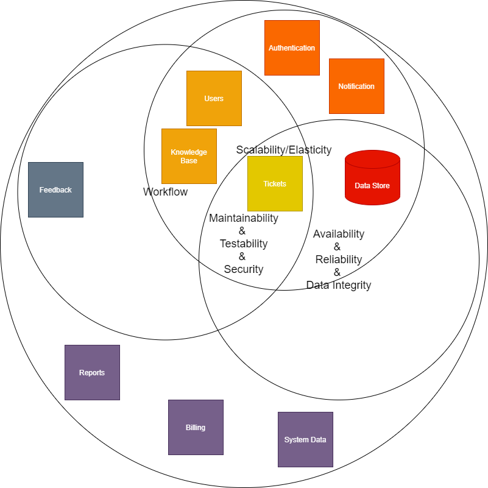

# Architecture Analysis

## Key Architecture Characteristics

By identifying the key architecture characteristics for this solution we can then identify the least-worst solution. Best practice is to identify no more than 7.

| Characteristic         | Source                                                       |
| ---------------------- | ------------------------------------------------------------ |
| Reliability            | - lost tickets - ticket assigned to wrong expert (incorrect skills) |
| Data Integrity         | - lost tickets - ticket assigned to wrong expert (incorrect skills) |
| Workflow               | - lost tickets - ticket assigned to wrong expert (incorrect skills) |
| Scalability/Elasticity | - system frequently freezes up / crashes - thought to be because of a spike in usage |
| Availability           | - the system is not always available for web-based and call-based ticket management |
| Maintainability        | - change is difficult and risky - change take a long time and usually breaks something else |
| Testability            | - change is difficult and risky - change take a long time and usually breaks something else |

## Architectural Quanta

Of the characteristics identified above, do they apply to the whole system or are there clear sets applying to different parts of the system?

### Table View

| Identified Domains                     | Applicable Architectural Characteristics                     |
| -------------------------------------- | ------------------------------------------------------------ |
| Users                                  | - Workflow - Scalability/Elasticity - Maintainability - Testability |
| Tickets                                | - Workflow - Reliability - Data Integrity - Scalability/Elasticity - Availability - Maintainability - Testability |
| Knowledge Base                         | - Workflow - Scalability/Elasticity - Maintainability - Testability |
| System Data (e.g. supported products)  | - Maintainability - Testability                         |
| Authentication                         | - (implicit characteristic) Security - Scalability/Elasticity - Maintainability - Testability |
| Billing                                | - (implicit characteristic) Security - Maintainability - Testability |
| Feedback                               | - Workflow - Maintainability - Testability         |
| Reports                                | - Maintainability - Testability                         |
| Notification                           | - Scalability/Elasticity                                     |
| Data Store (either single or multiple) | - Reliability - Data Integrity - Scalability/Elasticity - Availability - Maintainability - Testability |

### Venn Diagram

This diagram illustrates that although there are many shared characteristics, even those that are shared are shared by domains that do not themselves overlap. This leads us to a distributed architecture with deployment, backup and disaster recovery needing to take into account these characteristics. These characteristics may also inform further granularity of these domains.

## System Granularity

A breakdown of the key granularity analysis and links to ADRs.

### Ticket Management

| Functionality                     | Volatility | Scalability         | Fault Tolerance | Data Security | Data Transactions                  | Data Dependencies                  | Workflow                                                     |
| --------------------------------- | ---------- | ------------------- | --------------- | ------------- | ---------------------------------- | ---------------------------------- | ------------------------------------------------------------ |
| Management (Create, update, read) | Low        | Elasticity required | Split required  | Same          | Ticket data & history              | Ticket data & history              | Assignment is next in workflow                               |
| Assignment                        | High       | Elasticity required | Split required  | Same          | Ticket data & history, Expert data | Ticket data & history, Expert data | Update is the only element of Management that could be required. |

[ADR: Separate Tickets into Management & Assignment](../4.ADRs/006We-will-separate-Ticket-Management.md)

### User Management

| Functionality | Volatility | Scalability                                   | Fault Tolerance              | Data Security | Data Transactions                      | Data Dependencies                      | Workflow           |
| ------------- | ---------- | --------------------------------------------- | ---------------------------- | ------------- | -------------------------------------- | -------------------------------------- | ------------------ |
| Expert        | Low        | Unlikely to be required                       | Split required               | GDPR          | Expert profile, availability, skills   | Expert profile, availability, skills   | Separate           |
| Admin         | Low        | Unlikely to be required                       | Could be merged with Manager | GDPR          | Admin profile, admin permissions       | Admin profile, admin permissions       | Similar to Manager |
| Manager       | Low        | Edge case: end of period reporting, not often | Could be merged with Admin   | GDPR          | Manager profile, reporting permissions | Manager profile, reporting permissions | Similar to Admin   |
| Customer      | Low        | Elasticity required                           | Split required               | GDPR          | Customer profile                       | Customer profile                       | Separate           |

[ADR: Separate Users into Expert, Sysops User (Admin & Manager), & Customer](../4.ADRs/007We-will-separate-User-Management.md)

### Notification Sending

| Functionality           | Volatility | Scalability                 | Fault Tolerance | Data Security | Data Transactions                | Data Dependencies | Workflow                                     |
| ----------------------- | ---------- | --------------------------- | --------------- | ------------- | -------------------------------- | ----------------- | -------------------------------------------- |
| Send SMS                | Low        | Elasticity required: high   | Split required  | Same          | Customer mobile number           | Customer          | Separate                                     |
| Send Email              | Low        | Elasticity required: medium | Split required  | Same          | Customer email address           | Customer          | Separate                                     |
| Notification Preference | Low        | Elasticity required: high   | Split required  | Same          | Customer notification preference | Customer          | Redirect to SMS or Email based on preference |

[ADR: Separate Notification into SMS, Email and Orchestrator (Notification Preference)](../4.ADRs/008We-will-separate-Notification-Sending.md)

### Reports

| Functionality                    | Volatility | Scalability | Fault Tolerance | Data Security | Data Transactions | Data Dependencies | Workflow |
| -------------------------------- | ---------- | ----------- | --------------- | ------------- | ----------------- | ----------------- | -------- |
| Create Report / Report requested | Medium     | Low usage   | Same            | Same          | Same              | Same              | Same     |
| Request data from data store     | Low        | Low usage   | Same            | Same          | Same              | Same              | Same     |

[ADR: Reporting will not be further broken down](../4.ADRs/012We-will-not-separate-reporting.md)

### Knowledge

| Functionality          | Volatility | Scalability  | Fault Tolerance                             | Data Security | Data Transactions       |
| ---------------------- | ---------- | ------------ | ------------------------------------------- | ------------- | ----------------------- |
| Create article         | Low        | Low usage    | Split required from retrieve                | Same          | Article                 |
| Retrieve article       | Low        | High usage   | Split required from create, edit and delete | Same          | Content, tags, keywords |
| Edit article content   | Low        | Medium usage | Split required from retrieve                | Same          | Content                 |
| Edit article tags      | Low        | Medium usage | Split required from retrieve                | Same          | Tags                    |
| Edit article keywords  | Low        | Medium usage | Split required from retrieve                | Same          | Keywords                |
| Archive/delete article | Low        | Low usage    | Split required from retrieve                | Same          | Article                 |

[ADR: Separate Knowledge into Article Management, Article Retrieval and Article Updater](../4.ADRs/013We-will-separate-Knowledge-Management)

---

[NOTE: the same analysis is required of other parts of the system but this kata is time-restricted]

