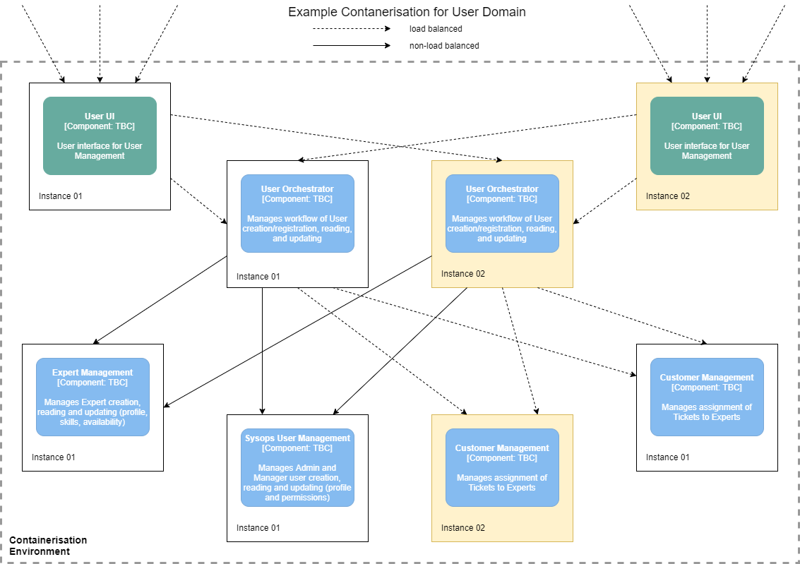

# Deployment Overview

To meet the availability and elasticity requirements of the system the following is suggested:

## Containers

The main advantages of using containers to host the various services within the system are:

- Scalability/elasticity on the service level, so each service is scaled as required
- Fast and automatic deployment, managed by the container controller (e.g. spin up a new updated instance, check ok, take down the old instance, repeat... )
- Routing between services is managed by the containerisation platform (e.g. load balancing between instances of the same service, routing to requested service)
- Reduced cost of infrastructure
  - Many containers on one VM, rather than many VMs
  - Elasticity is managed so only the required number of instances of any service is is use
  - Compatible with Cloud to reduce CapEx

## Example Diagram

------

back to [Solution Overview](README.md)