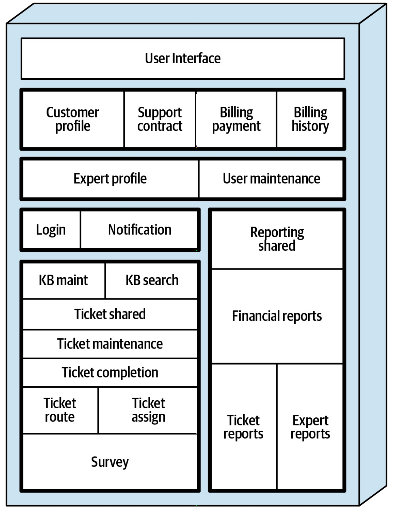
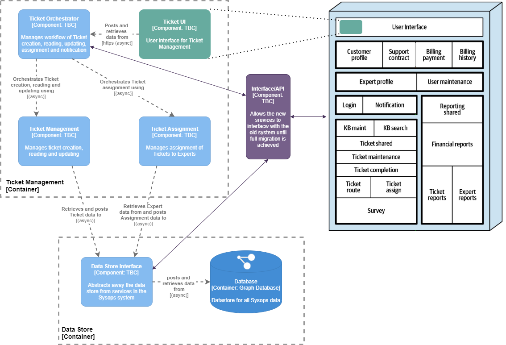

# Project Roadmap

In order to overcome the most critical business problems with the current Sysops Squad system, a [gradual migration approach](Migration.md) has been designed. This approach will aim to solve the most critical problems with the current system first, without having to build the entire new Sysops system before migration can begin.

## Current System

The following diagram shows the current Sysops system monolithic architecture and component breakdown within.

---

## First Iteration

### Aim: fix the most business-critical problem

The most critical problem with the current Sysops system has been identified as the ticketing component. This is linked to [concerns affecting several stakeholders](../1.ProblemBackground/StakeholderConcerns.md):

#### Management

- damage to brand
- loss of customers to competitors

#### Customer

- no-show of expert
- wrong expert showing up

#### Expert

- not being able to fix the problem when arriving

### Overview

- replace the current ticketing logic with new ticketing domain services
- replace the current ticket management UI with embedded new micro-font-end ticket management UIs, within the current UI.
- if required, create an interface or API within the current monolith for the new ticketing services to interact with the current system
- create the new data store interface service, including migration logic for current ticketing data
- create and start to store data in the new graph database, migrating current data into the new database when it is first accessed and then using the graph copy as the master copy

### System Diagram

---

## Second Iteration

### Aim: fix the next most business-critical problem

TBC after consultation with stakeholders.

---

## Nth Iteration

As many iterations as are necessary until migration is complete. TBC after consultation with stakeholders.

---

## Aim for Migration

Once all services have been migrated from the current to the new design the overall system will have a service architecture with a micro font-end. As each service and UI are built and tested and then migrated to, the current system will be phased out until none of it remains in use.

During, and once migration is complete new iterations on the structure of the system are possible when new information comes to light.

------

back to [Solution Overview](README.md)
