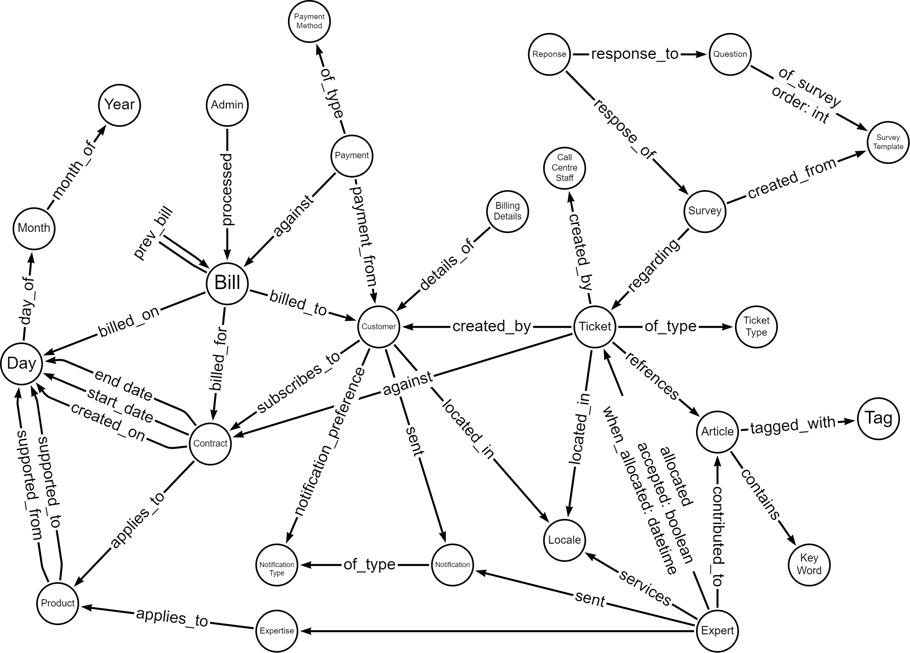

# Datastore Solution Overview

## Datastore Requirements

### Functional

| Reference | Requirement                                                  | Ref Business  Requirement |
| --------- | ------------------------------------------------------------ | ------------------------------ |
| F.DS.01   | Store and retrieve authentication/security details for Customers and Sysops Squad users | 1,6                            |
| F.DS.02   | Store and retrieve personal/profile details for Customers and Experts | 1,6                            |
| F.DS.03   | Store and retrieve Ticket details                            | 3,8,9                          |
| F.DS.04   | Store and retrieve Billing details                           | 4,6                            |
| F.DS.05   | Store and retrieve Feedback/Survey questions and answers     | 5                              |
| F.DS.06   | Store and retrieve Expert Skill details                      | 6                              |
| F.DS.07   | Store and retrieve Expert Locale details                     | 6                              |
| F.DS.08   | Store and retrieve Expert availability details               | 6                              |
| F.DS.09   | Store and retrieve Sysops User permissions (admin/customer service/expert/customer) | 6,12,13                        |
| F.DS.10   | Store and retrieve Knowledge Base articles, tags and keywords | 6,10                           |
| F.DS.11   | Manage relationships between all the entities                | (all)                          |
| F.DS.12   | Store and retrieve all data required for Manager reports     | 13                             |
| F.DS.13   | Store and Retrieve Product information                       | 2,7                            |
| F.DS.14   | Store and Retrieve log information (errors, communications, etc) | NF1                            |

### Non-Functional

| Reference | Requirement                                      | Ref Business  Requirement |
| --------- | ------------------------------------------------ | ------------------------------ |
| N.DS.01   | Data must be accurate when reading and writing   | NF1                            |
| N.DS.02   | Data should be fast to retrieve                  | NF2                            |
| N.DS.03   | Allow data migration from the current data store | 14                             |
| N.DS.04   | Have high availability                           | NF2                            |
| N.DS.05   | Easy to update the schema                        | NF3                            |
| N.DS.06   | Easily maintainable querying                     | NF3                            |

## Considered Data Store Approaches

### Relational

#### Requirements Not/Partially Met

- F.DS.11 - can be done, but complex code required to retrieve
- N.DS.02 - may not meet this because of complex nature of relationships, requiring many joins of tables
- N.DS.05 - when updating the schema of a table then all rows must be updated to this new schema (and backend and frontend code must be able to contend with removed information)
- N.DS.06 - not met due to complexity of joins to maintain relationships

### Document

#### Requirements Not Met

- N.DS.02 - may not meet this because of complex nature of relationships
- N.DS.06 - unknown, may depend on specific technology

### Graph

#### Requirements Not Met

None.

### Encryption

Data will be encrypted at rest and in-flight

### Polyglot Persistence (Combination)

Polyglot Persistence would be considered, at this point, if any one type did not meet all the above requirements. Graph does meet all the requirements, but this does not rule out adding other types of data stores in the future if it were deemed a good architectural decision. This architecture is designed to be agile in nature.

## Datastore Decisions

[We will use a graph database as a data store for SysOps Squad](../../4.ADRs/005We-will-use-a-Graph-Database.md)

## Datastore Design Overview

The following diagram shows how the nodes and relationships within the graph database will be set up. Although only Bill, Contract and Product currently reference the Day node, any of the other nodes such as Payment could also do this instead of storing that data within the node as a property.

### Graph Node and Relationship Design Overview

#### Notes

- this diagram was not specifically designed around the Customer, but grew to show how central the Customer is to the model
- only some properties of some relationships are shown, but all nodes and relationships will contain the appropriate properties (like columns in the current relational database)

------

back to [Solution Overview](../README.md)
