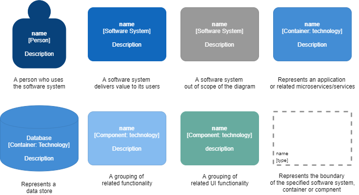
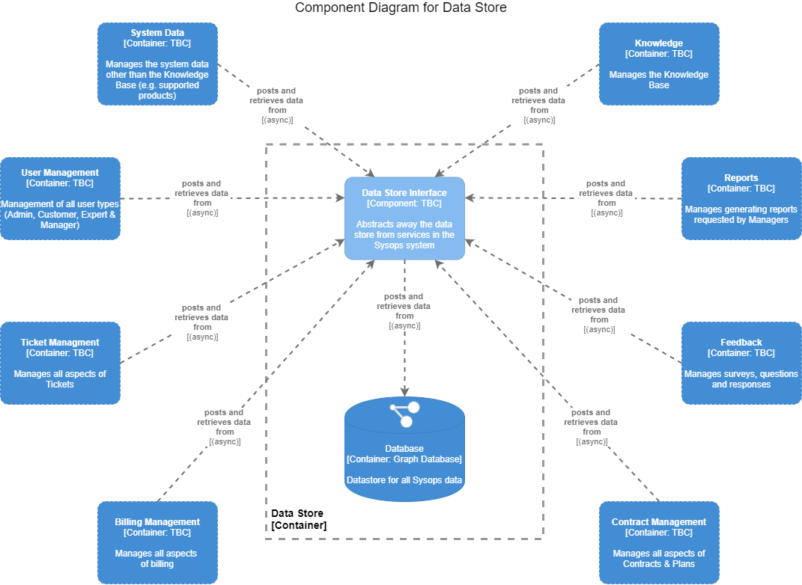

# C4 Infrastructure Models

A C4 model is a common set of abstractions to create used to describe the static structure of a software system; these abstractions having four levels: **software system**, **containers**, **components** and **code**. **People** use the software system.

The following diagrams use the standard C4 notation, with the addition of a different colour to highlight a UI Component, as opposed to a back-end component, in our micro front-end ([see ADR: 003 We-will-use-a-Micro-Frontend-architecture](../../4.ADRs/003We-will-use-a-Micro-Frontend-architecture.md)).

## C4 Model Key

## Context Diagram (Level 1 - top level)

A **System Context** diagram provides a starting point, showing how the software system in scope fits into the world around it.[^](#expl) 
This diagram shows how the main users of Sysops Squad interact with the system, and the other systems that the Sysops Squad system interacts with.

------

## Container Diagram (Level 2)

A **Container** diagram zooms into the software system in scope, showing the high-level technical building blocks.[^](#expl)
The following diagram breaks down the Sysops Squad system into groups of related functionality, or domains, and shows how they interact with each other and how the users of the Sysops system interact with the functionality.

------

## Component Diagrams (Level 3)

A **Component** diagram zooms into an individual container, showing the components inside it.[^](#expl)
The following diagrams break down the containers/functionality shown above further, into components which represent individually deployable services.

#### Relevant ADRs

- [002 We-will-use-a-Service-Based-backend-architecture](../../4.ADRs/002We-will-use-a-Service-Based-backend-architecture.md)

### Ticket Management

The following diagram shows the individually deployable services in the Ticket Management domain, and how they interact with each other, users and other domains.

#### Relevant ADRs

- [006 We-will-separate-Ticket-Management](../../4.ADRs/006We-will-separate-Ticket-Management.md)

------

### User Management

The following diagram shows the individually deployable services in the User Management domain, and how they interact with each other, users and other domains.

#### Relevant ADRs

- [007 We-will-separate-User-Management](../../4.ADRs/007We-will-separate-User-Management.md)

------

### Notification Management

The following diagram shows the individually deployable services in the Notification Management domain, and how they interact with each other, users and other domains.

#### Relevant ADRs

- [008 We-will-separate-Notification-Sending](../../4.ADRs/008We-will-separate-Notification-Sending.md)

------

### Data Store

The following diagram shows the individually deployable services in the Notification Management domain, and how they interact with each other, users and other domains.

#### Relevant ADRs

- [005 We-will-use-a-Graph-Database](../../4.ADRs/005We-will-use-a-Graph-Database.md)
- [009 We-will-abstract-away-the-data-store](../../4.ADRs/009We-will-abstract-away-the-data-store.md)

---

^explanations from https://c4model.com/

------

back to [Views & Perspectives](../README.md)