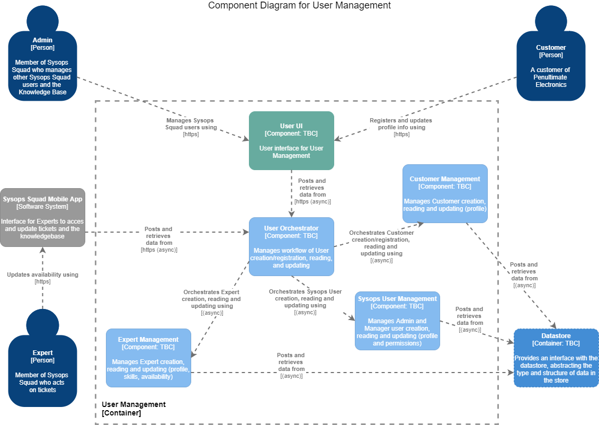

# C4 Infrastructure Models

## Context Diagram (Level 1 - top level)

A **System Context** diagram provides a starting point, showing how the software system in scope fits into the world around it.^

------

## Container Diagram (Level 2)

A **Container** diagram zooms into the software system in scope, showing the high-level technical building blocks.^

------

## Component Diagrams (Level 3)

A **Component** diagram zooms into an individual container, showing the components inside it.^

### Ticket

------

### User

------

### Notification

------

^explanations from https://c4model.com/

------

back to [Views & Perspectives](../README.md)
