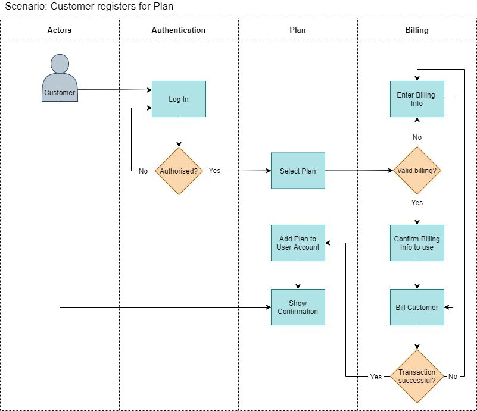
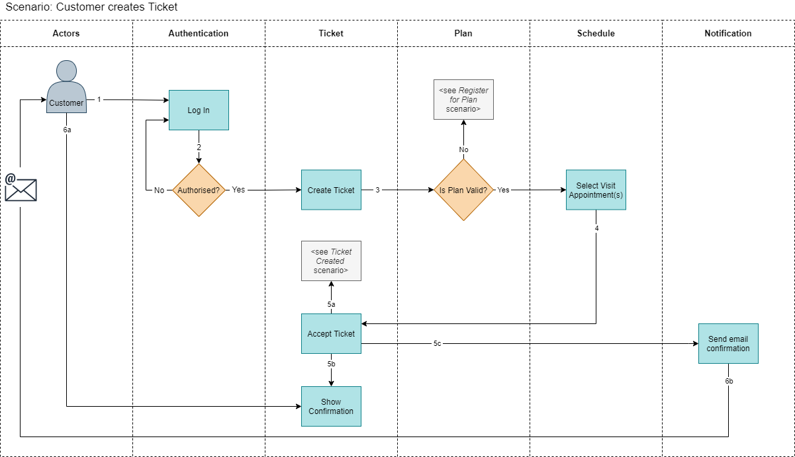
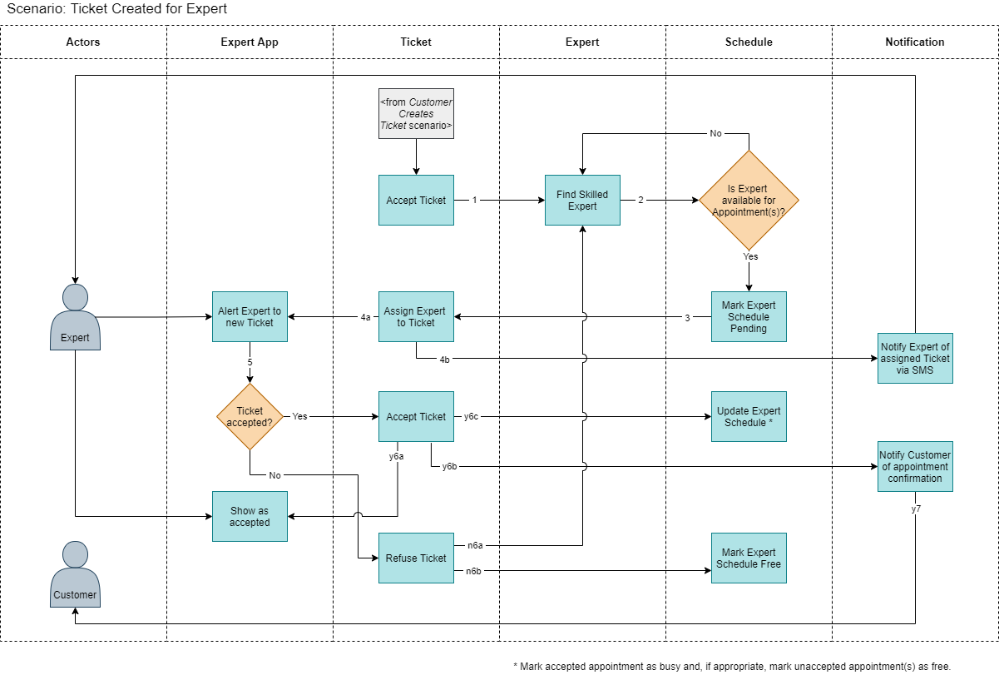
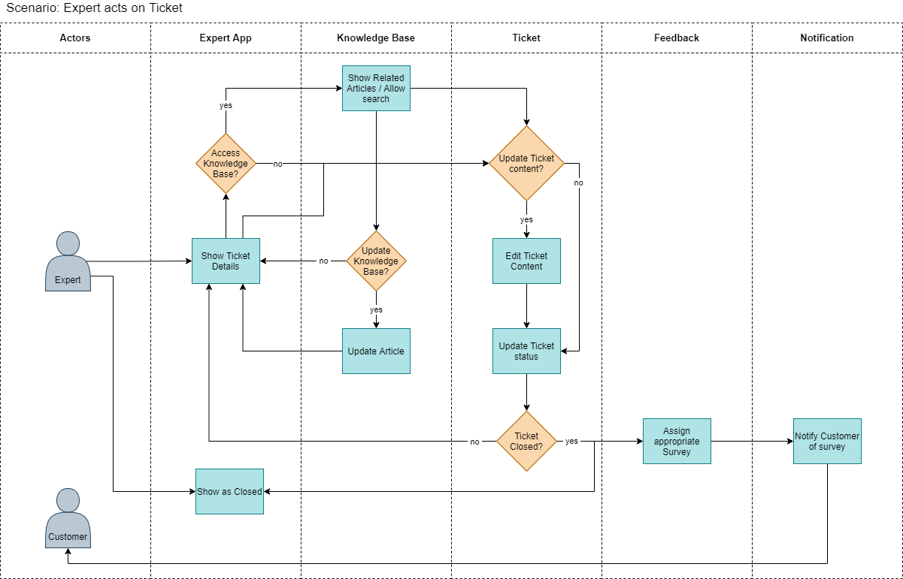

# Scenario Flow Diagrams

Scenarios key to architecture design.

## 01 Customer registers for a plan/contract

## 02 Customer creates a Ticket

## 03 Ticket created for Expert

## 04 Expert acts on Ticket

