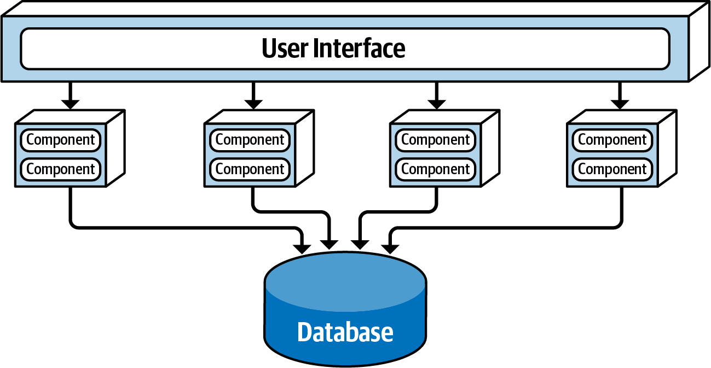

# Service-Based Backend Architecture

Date: 2021-04-29

## Status

Accepted

## Context

The overall architecture of this project is based on our general architecture principles of using a modular and pattern-based architecture. Architecture patterns were assessed against the architecture principles identified from the brief.

## Decision

The backend architecture will be based on the Service-Based architecture pattern, illustrated below and described in detail in [Fundamentals of Software Architecture by Neal Ford and Mark Richards]([Fundamentals of Software Architecture](https://learning.oreilly.com/library/view/fundamentals-of-software/9781492043447/)).

[Figure 13-1. Basic topology of the service-based architecture style, from Fundamentals of Software Architecture by Neal Ford and Mark Richards]

## Consequences

**Positive:**

- Modules/services can be independently maintained and deployed, making it possible to reduce time-to-market.
- No need to split the data store, as would be the case with using a Micro-Services architecture.

**Negative:**

- User interface (frontend) is still a mini-monolith within the system, and doesn't gain the benefits of breaking up the backend.

**Risks:**

- Updating the data store needs to take into account that modules/services outside the control of a development team may be using the same data.

**Bonus Features:**

- Supports the need to move to a new system quickly in that services/modules can be written, tested and then replace parts of the current system bit by bit.